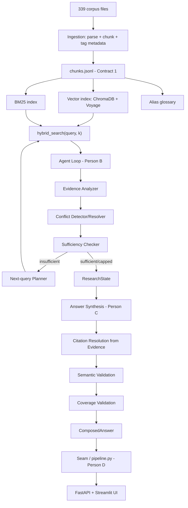
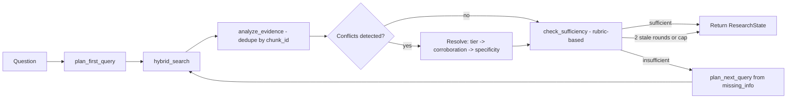
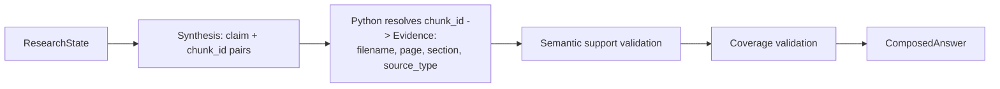

# Architecture

## Overview

Ashen Researcher answers questions against the Ashen Era Archive — 339 corpus files
(chronicles, wiki, codex, ephemera, standalone images) — using an iterative agentic
loop rather than a single retrieval pass. The system searches, checks whether evidence
is actually sufficient, and searches again with what it learned, until it can produce
a fully cited answer or transparently state what remains unresolved. 11 of the 20
official sample questions require information contained in image pixels alone, which
is why a vision fallback is a required part of the architecture, not optional polish.

## Pipeline

## Component ownership and exact contracts

| Component | Owns | Exact function/contract | Consumed by |
|---|---|---|---|
| A — Ingestion & Retrieval | Parsing, chunking, indexing | `hybrid_search(query, k) -> list[dict]`, `baseline_rag(question) -> str` | B, D |
| B — Agent Loop | Iterative search, sufficiency, conflict resolution | `research(question, search_fn, max_iter) -> ResearchState` | C, D |
| C — Answer Composition & Evaluation | Synthesis, citation/coverage/semantic validation | `compose_answer(state, *, synthesize, validate_semantics, validate_coverage) -> ComposedAnswer` | D |
| D — Interface & Integration | HTTP API, UI, packaging, robustness layer | `POST /ask`, `POST /ask/stream`, `GET /health`, `GET /health/detail`, `GET /source?filename=` | End user / judges |

No component imports another's Python directly except through D's seam module
(`pipeline.py`), which resolves each teammate's entry point from a configurable
`module:function` string at call time and falls back to fixtures when one is missing.
This was a deliberate architectural choice: with four people building in parallel,
direct imports would mean the interface couldn't exist until every other component
finished, concentrating all integration risk into the final two days.

## The agent loop, in detail

The sufficiency checker scores evidence against a fixed rubric (coverage / agreement /
unresolved) rather than asking the model to self-rate confidence — self-rated
confidence is a known weak signal, since models frequently report high confidence even
when wrong. Two stop conditions are enforced in code: a hard iteration cap (5), and
early-stop after two consecutive rounds that add no new evidence.

## Answer composition, in detail

The LLM identifies which `chunk_id` supports each claim, but Python — never the LLM —
resolves that ID against `ResearchState.evidence` and copies the real filename, page,
section, and source type. This means the system cannot hallucinate a citation's
metadata even if the claim text itself is fluent and plausible-sounding.

## Contracts

- **Contract 1 (chunk format)**: `chunk_id`, `document_id`, `filename`, `source_type`,
  `reliability`, `page`, `section`, `content_type`, `text`, `entities`. `content_type`
  distinguishes `"text"`, `"table"`, `"image"`, and (loop-generated only)
  `"vision_description"`.
- **Contract 2 (search)**: `hybrid_search(query: str, k: int = 8) -> list[dict]`
- **Contract 3 (ResearchState)**: question, route, `required_claims`, iteration count,
  search history, evidence, discovered entities, conflicts (with resolutions),
  unresolved claims, confidence, trace.
- **ComposedAnswer**: `{question, answer, status, confidence, citations, conflicts,
  iterations_used}`. `status` is one of `complete`, `complete_with_conflict`,
  `partial_gap_stated`. Citations are `{claim, filename, page, section, source_type}`,
  with fallback: page present → filename+page; no page but section → filename+section;
  neither → filename only.
- **Model adapters (Person C uses, Person D provides)**: `synthesize(prompt) -> str`,
  `validate_semantics(claim, evidence) -> {"supported": bool, "reason": str}`,
  `validate_coverage(question, answer) -> {"complete": bool, "missing": [str]}`. All
  three route through one shared `call_llm()` transport (Person B's, adapted by
  Person D) rather than each component running its own OpenRouter client and its own
  retry policy.

## Handling of image-only evidence (vision fallback)

Corpus validation found that visual facts (artifact motifs, portrait contents, banner
emblems) are never described in surrounding text — several wiki entries explicitly
state "no separate physical form is specified" beside a visually detailed image. Every
standalone image is indexed as its own `content_type: "image"` evidence chunk. When
the only relevant evidence for a question is such a chunk, the original image file is
sent to a vision-capable model; the result becomes a new `Evidence` item
(`content_type: "vision_description"`, `source_type: "image_derived"`) citing the
*original* image filename — provenance and citation logic stay identical to any other
evidence. Person C treats this evidence like any other text evidence for citation and
support checking, rather than running a second, independent vision-validation call —
deliberately, to avoid duplicating B's responsibility and doubling API cost for a
check that would likely just ask the same kind of model to re-verify its own visual
read.

## Honest reporting of system state

Rather than one boolean ("real" vs. "stub"), `/health` reports four independent flags:
retrieval availability, agent loop availability, composer availability, and whether
the displayed research trace is live or replayed. This exists because a single flag
was wrong three separate times during integration, every time showing green — most
seriously, the real agent loop ran to completion over fixture data (not the real
archive) while reporting `pipeline: "real"`, because its default `search_fn` argument
silently pointed at the fake stand-in. One flag cannot express "the loop is real and
the archive was never opened"; four flags can, and the UI surfaces a warning naming
that exact state when it occurs.